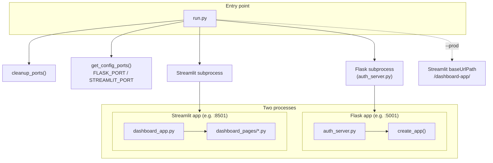
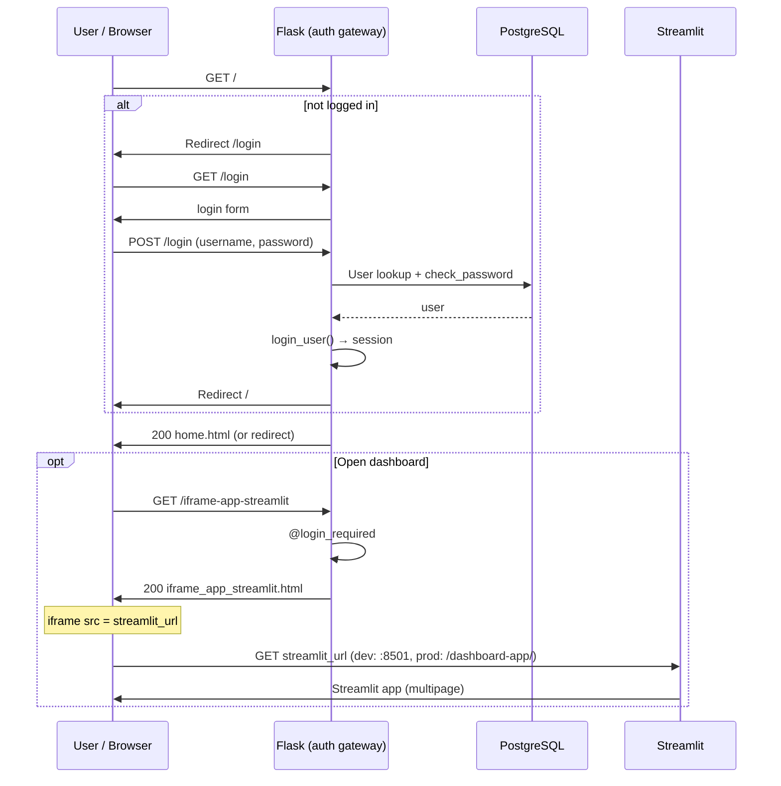
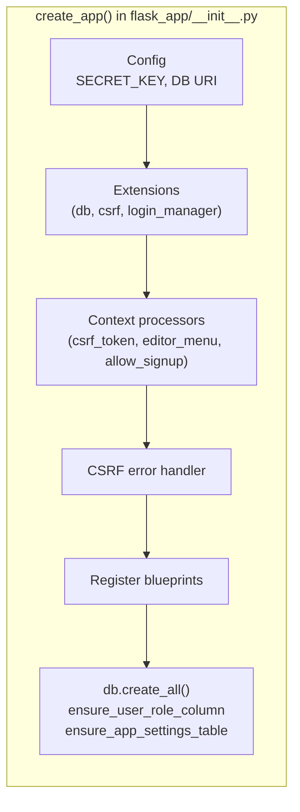
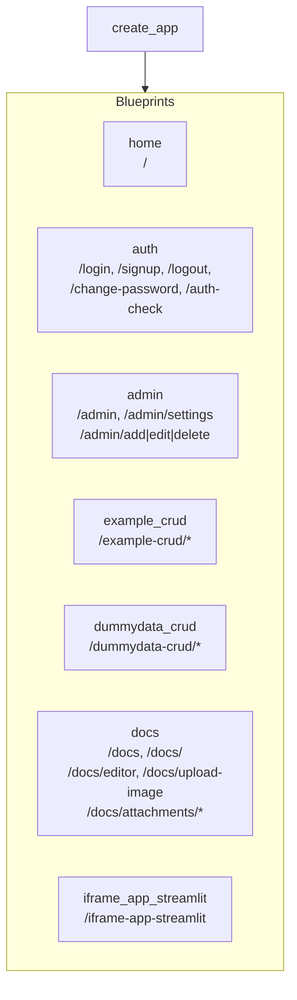
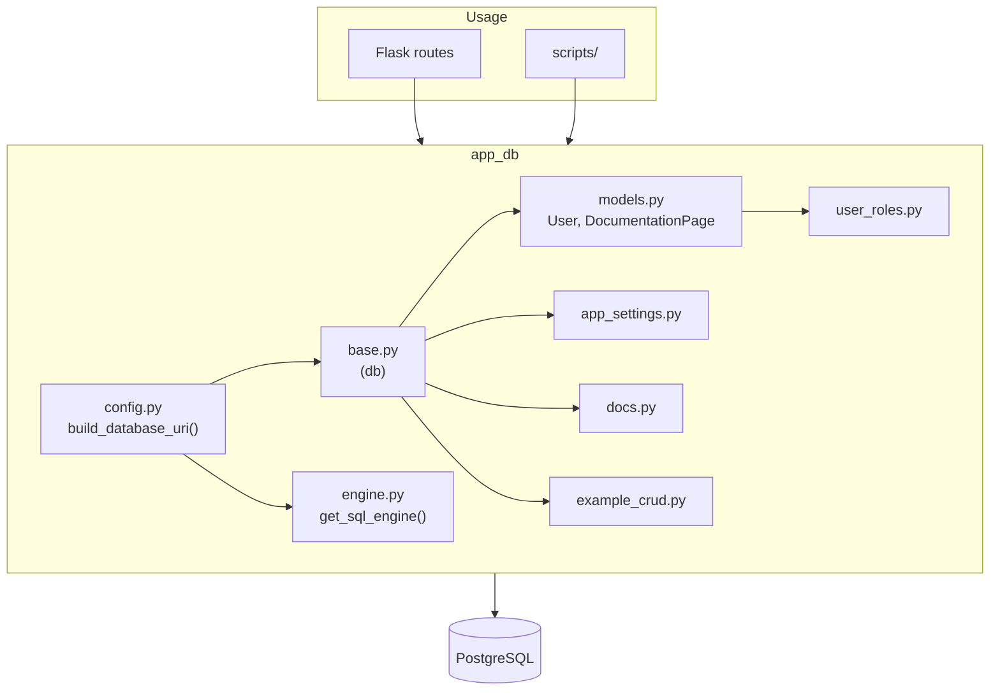
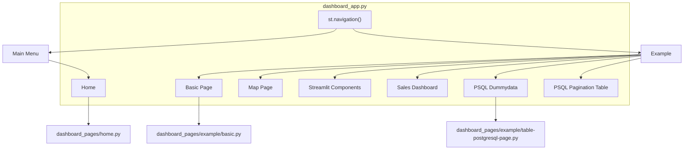
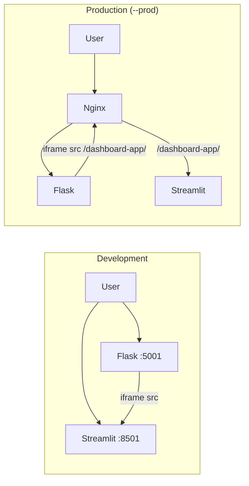

# Starter Kit Architecture — Mermaid Diagrams

How the Flask auth gateway + Streamlit dashboard boilerplate works.

---

## 1. Runtime & process layout

- **run.py** starts both servers and (in `--prod`) configures Streamlit for the `/dashboard-app/` proxy path.
- **Flask** is the auth/session gateway; **Streamlit** is the dashboard UI, either on its own port (dev) or under Nginx (prod).

---

## 2. Request flow: user → login → app

- All protected routes go through Flask; session is Flask-Login.
- Streamlit is loaded inside an iframe; in dev the iframe points to `http://localhost:8501`, in prod to `/dashboard-app/`.

---

## 3. Flask app structure (create_app)

- One Flask app; blueprints provide routes. Auth is enforced with `@login_required` and role checks where needed.

---

## 4. Data & database

- **ORM** (Flask-SQLAlchemy): `User`, `DocumentationPage`; core CRUD and auth.
- **Raw SQL** (engine from `app_db.config`): reporting, complex queries, feature tables (e.g. dummydata).
- DB URI comes only from `app_db/config.py` (env: `DATABASE_URL` or `DB_*`).

---

## 5. Streamlit multipage navigation

- Streamlit runs as a separate process; pages live under `dashboard_pages/`. Business logic and DB access stay in `app_db`/Flask; Streamlit focuses on UI.

---

## 6. Dev vs prod (Streamlit URL)

- **Dev:** User hits Flask; Flask serves HTML with an iframe to `http://localhost:STREAMLIT_PORT`. User (or iframe) talks to Streamlit on that port.
- **Prod:** Nginx fronts both; Streamlit is mounted at `/dashboard-app/`; Flask serves pages that embed iframe `src="/dashboard-app/"`.

---

## Summary

| Layer            | Responsibility                                      |
|-----------------|------------------------------------------------------|
| **run.py**      | Start Flask + Streamlit; port cleanup; prod base path |
| **Flask**       | Auth (Flask-Login), CSRF, session, all HTML routes   |
| **Streamlit**   | Dashboard UI (multipage), no auth (gated by Flask)   |
| **app_db**      | PostgreSQL: ORM (User, docs) + raw SQL helpers      |
| **Templates**   | Jinja; base.html; CSRF on every POST form           |

All access to the app is through Flask first; the dashboard is shown via an iframe to Streamlit (direct in dev, via `/dashboard-app/` in prod).
