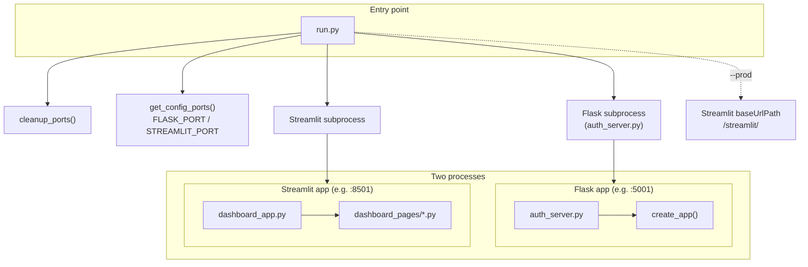
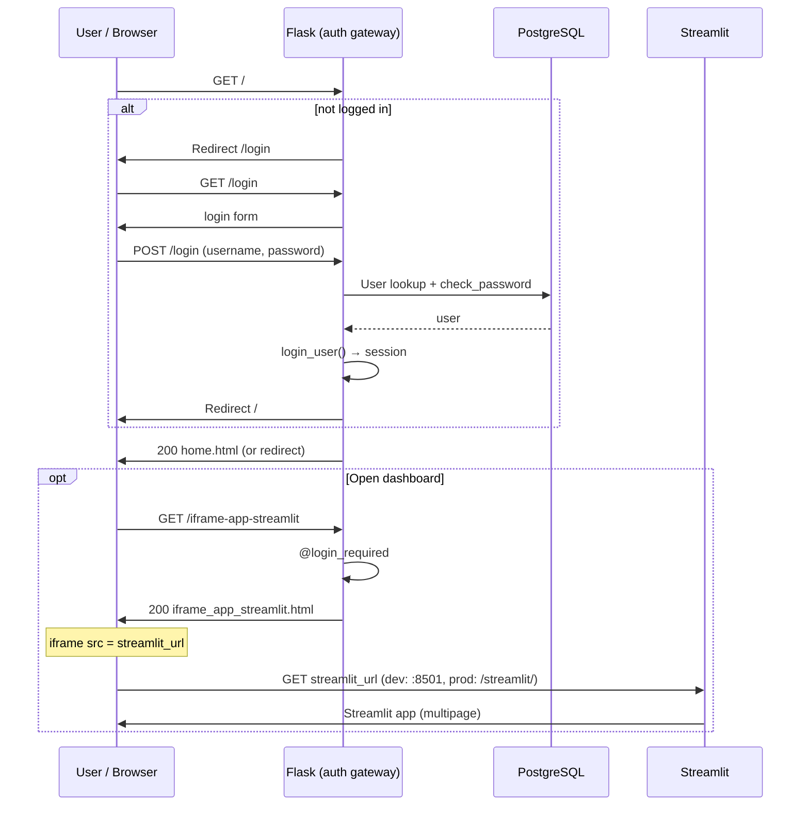
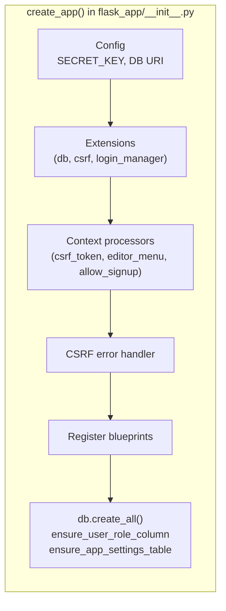
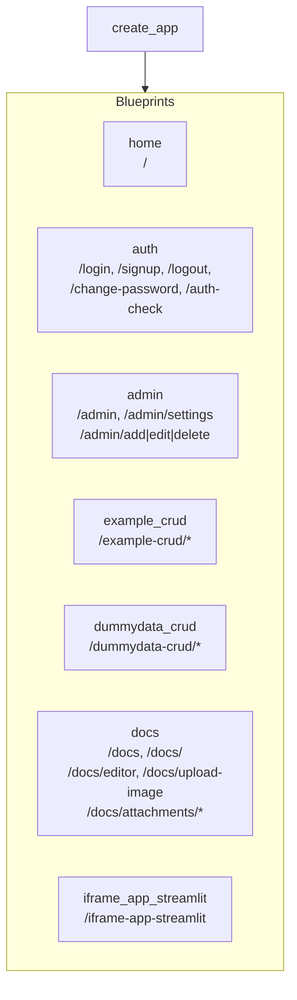
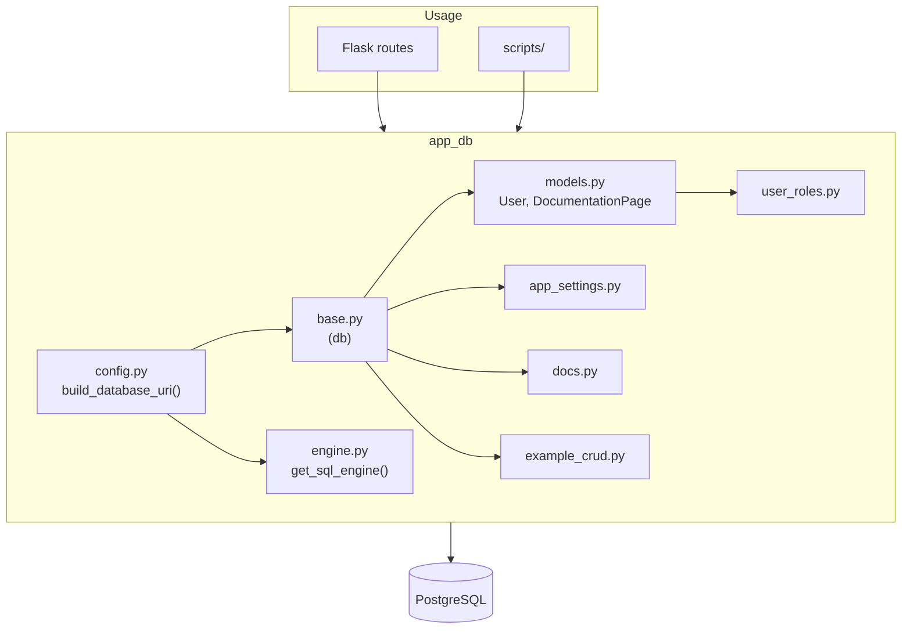
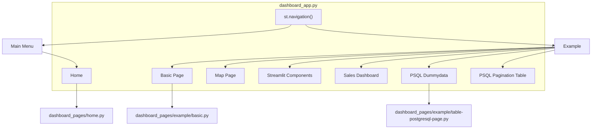
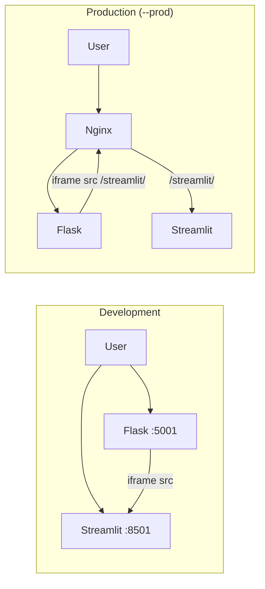

# Framework Reference — Architecture, Design & User Guide

This document merges **Architecture Diagrams**, **Design System**, and **Framework Guide** into a single reference for the Flask auth gateway + Streamlit dashboard starter kit.

**New to this project?** When adding a **new Flask page**, follow [Section 19 (User Guide)](#19-adding-a-new-protected-flask-page) and do all four steps. When adding a **new Streamlit page**, follow [Section 23 (User Guide)](#23-adding-a-new-streamlit-dashboard-page). To **remove all demo features** for a minimal framework, see **[CLEAN_FRAMEWORK.md](CLEAN_FRAMEWORK.md)**.

---

## Table of Contents

**Part I — Architecture & Diagrams**
1. [Runtime & process layout](#1-runtime--process-layout)
2. [Request flow: user → login → app](#2-request-flow-user--login--app)
3. [Flask app structure (create_app)](#3-flask-app-structure-create_app)
4. [Data & database](#4-data--database)
5. [Streamlit multipage navigation](#5-streamlit-multipage-navigation)
6. [Dev vs prod (Streamlit URL)](#6-dev-vs-prod-streamlit-url)
7. [Architecture summary](#architecture-summary)

**Part II — Design System**
8. [Design principles](#8-design-principles)
9. [Page structure](#9-page-structure)
10. [Components and classes](#10-components-and-classes)
11. [Naming conventions](#11-naming-conventions)
12. [Checklist for new pages](#12-checklist-for-new-pages)

**Part III — User Guide**
- [13. Architecture overview (key dirs)](#13-architecture-overview-key-dirs)
- [14. Authentication](#14-authentication)
- [15. Protecting pages with @login_required](#15-protecting-pages-with-login_required)
- [16. Roles & authorization](#16-roles--authorization)
- [17. Using @role_required](#17-using-the-role_required-decorator)
- [18. Adding a new role](#18-adding-a-new-role)
- [19. Adding a new protected Flask page](#19-adding-a-new-protected-flask-page)
- [20. Adding a role-restricted page](#20-adding-a-role-restricted-page)
- [21. CSRF protection on forms](#21-csrf-protection-on-forms)
- [22. Embedding Streamlit via iframe](#22-embedding-streamlit-via-iframe)
- [23. Adding a new Streamlit dashboard page](#23-adding-a-new-streamlit-dashboard-page)
- [24. Navigation bar — showing/hiding links by role](#24-navigation-bar--showinghiding-links-by-role)
- [25. Managing users](#25-managing-users)
- [26. Adding a full CRUD feature](#26-adding-a-full-crud-feature)
- [27. Database access patterns](#27-database-access-patterns)
- [28. Environment variables](#28-environment-variables)
- [29. Base CSS & style guide](#29-base-css--style-guide)
- [30. Quick reference — decorators & templates](#30-quick-reference--decorators--templates)

---

# Part I — Architecture & Diagrams

How the Flask auth gateway + Streamlit dashboard boilerplate works.

---

## 1. Runtime & process layout



- **run.py** starts both servers and (in `--prod`) configures Streamlit for the `/streamlit/` proxy path.
- **Flask** is the auth/session gateway; **Streamlit** is the dashboard UI, either on its own port (dev) or under Nginx (prod).

---

## 2. Request flow: user → login → app



- All protected routes go through Flask; session is Flask-Login.
- Streamlit is loaded inside an iframe; in dev the iframe points to `http://localhost:8501`, in prod to `/streamlit/`.

---

## 3. Flask app structure (create_app)





- One Flask app; blueprints provide routes. Auth is enforced with `@login_required` and role checks where needed.

---

## 4. Data & database



- **ORM** (Flask-SQLAlchemy): `User`, `DocumentationPage`; core CRUD and auth.
- **Raw SQL** (engine from `app_db.config`): reporting, complex queries, feature tables (e.g. dummydata).
- DB URI comes only from `app_db/config.py` (env: `DATABASE_URL` or `DB_*`).

---

## 5. Streamlit multipage navigation



- Streamlit runs as a separate process; pages live under `dashboard_pages/`. Business logic and DB access stay in `app_db`/Flask; Streamlit focuses on UI.

---

## 6. Dev vs prod (Streamlit URL)



- **Dev:** User hits Flask; Flask serves HTML with an iframe to `http://localhost:STREAMLIT_PORT`. User (or iframe) talks to Streamlit on that port.
- **Prod:** Nginx fronts both; Streamlit is mounted at `/streamlit/`; Flask serves pages that embed iframe `src="/streamlit/"`.

---

## Architecture summary

| Layer            | Responsibility                                      |
|-----------------|------------------------------------------------------|
| **run.py**      | Start Flask + Streamlit; port cleanup; prod base path |
| **Flask**       | Auth (Flask-Login), CSRF, session, all HTML routes   |
| **Streamlit**   | Dashboard UI (multipage), no auth (gated by Flask)   |
| **app_db**      | PostgreSQL: ORM (User, docs) + raw SQL helpers      |
| **Templates**   | Jinja; base.html; CSRF on every POST form           |

All access to the app is through Flask first; the dashboard is shown via an iframe to Streamlit (direct in dev, via `/streamlit/` in prod).

---

# Part II — Design System

HTML and CSS standards for the Flask-based internal tool framework. Use when adding or changing pages so the repo stays consistent.

---

## 8. Design principles

- **Modular CSS**: Styles live in `static/css/` as modular files. `base.css` is the entry point that imports all modules in cascade order. Do not add inline `<style>` blocks in templates; add new styles to the appropriate module (or create a new module and import it in `base.css`).
- **Extend base**: Every page extends `templates/base.html` and fills `` (and optionally `title`, `body_class`, `extra_css`).
- **Use design tokens**: Prefer CSS variables from `:root` (e.g. `var(--accent-color)`, `var(--radius)`) and existing utility/component classes instead of hardcoded colors or one-off styles.
- **No duplication**: Reuse existing classes (e.g. `btn`, `form-control`, `crud-panel`) rather than redefining the same look in templates.

---

## 9. Page structure

### 9.1 Base template

- **Logo**: `.logo` in the navbar — default text is "Internal Tool". Change it in `base.html` when branding your app.
- **Flash messages**: Rendered once in `base.html` via ``. Child templates must **not** repeat flash markup; override the block only if a page needs a different placement or styling.
- **Scripts**: Nav toggle and `AppModal` are in `base.html`. Page-specific JS stays in the page template at the bottom of ``.

### 9.2 Body classes

Set `` for layout:

| Class | Use |
|-------|-----|
| *(none)* | Centered content (e.g. login card). |
| `content-top` | Full-width, top-aligned (CRUD, admin, list pages). |
| `docs-light` | Docs section: light background, left-aligned content. |
| `page-dashboard` | Home/dashboard: full-height iframe, no padding. |

Use a single class or space-separated list, e.g. `content-top page-dashboard` for the dashboard.

### 9.3 Blocks

- **title**: Page title (browser tab). Keep short, e.g. "Login", "Admin Panel".
- **content**: Main HTML for the page.
- **extra_css**: Optional; only for extra stylesheets (e.g. Quill). Do not put inline CSS here.
- **body_class**: Optional; see above.
- **flash_messages**: Optional override; usually leave as default.

---

## 10. Components and classes

### 10.1 Buttons

- **Primary**: `btn btn-primary` (or `btn` alone; primary is default for submit).
- **Secondary / cancel**: `btn btn-secondary`.
- **Ghost**: `btn btn-ghost`.
- **Danger**: `btn btn-danger`.
- **Sizing**: `btn-small` for compact; `w-auto` for non-full-width, `w-100` for full width.

Use these instead of inline `style="background: ..."`.

### 10.2 Forms

- **Group**: `form-group` wraps label + control.
- **Label**: `form-label` on `<label>`; use `for` and matching `id` on inputs.
- **Inputs**: `form-control` on `<input>`, `<textarea>`, `<select>`; add `form-select` on `<select>`.
- **No inline styles** on form elements; use utility classes (e.g. `mt-2`, `d-none`).

### 10.3 Layout and utilities

- **Flex**: `d-flex`, `justify-content-between`, `align-items-center`, `gap-3`, etc. (see `base.css` and [Base CSS & style guide](#29-base-css--style-guide) in this document).
- **Spacing**: `m-0`, `mt-2`, `mb-3`, `p-4`, etc.
- **Text**: `text-muted`, `text-center`, `text-danger`, `small`.
- **Visibility**: `d-none` to hide (toggle via JS with `classList.add/remove('d-none')`).

### 10.4 CRUD pages

- **Container**: `crud-container` (or `admin-container` for admin).
- **Header**: `crud-header` with `h1` and `p.subtitle`.
- **Panel**: `crud-panel` for each card; panel title: `h3.crud-panel-title`.
- **Table**: `crud-table-wrapper` > `table.crud-table`; action cells use `.actions` with `btn btn-small btn-ghost` / `btn btn-small btn-danger`.
- **Form**: `form-compact` with `form-group`, `form-label`, `form-control`; submit `btn btn-primary`.

### 10.5 Modals

- Use the macro: `` and `...`.
- Content: `app-modal-content`, `app-modal-actions`, `app-modal-danger-icon`, `app-modal-body-muted` (all in `base.css`).
- Open/close via `AppModal.open('id')` and `AppModal.close('id')`.

### 10.6 Alerts and flash

- **Success / error in content**: Prefer `alert alert-success` or `alert alert-danger` for in-page messages.
- **Flash**: Styled automatically in base; uses `.flash-message` inside `.flash-messages`. For error emphasis, backend can flash and front-end will show it in the standard block.

---

## 11. Naming conventions

- **CSS**: Use kebab-case (e.g. `crud-panel-title`, `app-modal-actions`). Prefix feature-specific blocks (e.g. `docs-*`, `crud-*`, `admin-*`) to avoid clashes.
- **Templates**: `snake_case.html` for pages; `components/modal.html` for shared partials.
- **IDs**: Use kebab-case or snake_case for form fields and JS hooks (e.g. `item-name`, `edit_username`).

---

## 12. Checklist for new pages

1. Extend `base.html` and set `` and, if needed, ``.
2. Use only classes from the design system (`static/css/`); no inline styles or new `<style>` tags.
3. All POST forms include `` in a hidden input.
4. Buttons use `btn` + variant; forms use `form-group`, `form-label`, `form-control`.
5. Do not add a duplicate flash block; base already shows flashed messages.
6. For modals, use `components/modal.html` and `AppModal`.

**References:** [AGENTS.md](AGENTS.md) — Repo map, routes, and change playbooks. **static/css/** — Modular stylesheets; `base.css` imports variables, reset, navbar, home, footer, showcase, components, docs, utilities, crud, admin, dashboard.

---

# Part III — User Guide

How to use this framework to build authenticated, role-protected Flask pages and Streamlit dashboards.

---

## 13. Architecture overview (key dirs)

The app runs **two processes** started by `run.py`:

| Process       | File               | Default Port | Purpose                                            |
| ------------- | ------------------ | ------------ | -------------------------------------------------- |
| **Flask**     | `auth_server.py`   | `5001`       | Authentication gateway, HTML pages, API            |
| **Streamlit** | `dashboard_app.py` | `8501`       | Data dashboards (embedded inside Flask via iframe) |

In **development**, users visit `http://localhost:5001`. The home page (`/`) shows a portal; users navigate to `/iframe-app-streamlit` to load the Streamlit dashboard inside an iframe (pointing to `localhost:8501`). In **production** (`python3 run.py --prod`), Streamlit is reverse-proxied behind `/streamlit/` (typically via Nginx).

### Key directories

```
flask_app/              ← Flask app factory + extensions
flask_app/routes/       ← Blueprints (one file per feature)
app_db/                 ← Database models, helpers, engine
templates/              ← Jinja2 HTML templates
static/css/             ← Stylesheets
dashboard_pages/        ← Streamlit page modules
scripts/                ← CLI utilities (manage_admin, etc.)
```

---

## 14. Authentication

Authentication is handled by **Flask-Login**. The implementation lives in `flask_app/routes/auth.py`.

### How it works

- **User model** (`app_db/models.py`): stores `username`, `email`, `password` (hashed), and `role`.
- **Password hashing**: uses `werkzeug.security.generate_password_hash` / `check_password_hash`.
- **Session management**: Flask-Login tracks the logged-in user via a secure session cookie.

### Built-in auth routes

| Route              | Method   | What it does                                                                                  |
| ------------------ | -------- | --------------------------------------------------------------------------------------------- |
| `/login`           | GET/POST | Login form + credential check                                                                 |
| `/signup`          | GET/POST | Self-service registration (default role: `viewer`); can be disabled by admin in Site settings |
| `/logout`          | GET      | Logs out the current user                                                                     |
| `/change-password` | GET/POST | Change password form (logged-in users only)                                                   |
| `/auth-check`      | GET      | Returns `200 Authenticated` or `401 Unauthorized`                                             |

### User loader (required by Flask-Login)

> **FRAMEWORK CODE** — `flask_app/routes/auth.py` — already configured, no changes needed.

```python
# flask_app/routes/auth.py
@login_manager.user_loader
def load_user(user_id: str):
    return db.session.get(User, int(user_id))
```

### Login flow

> **FRAMEWORK CODE** — `flask_app/routes/auth.py` — already configured, no changes needed.

```python
# flask_app/routes/auth.py
@bp.route("/login", methods=["GET", "POST"])
def login():
    if current_user.is_authenticated:
        return redirect(url_for("home.index"))

    if request.method == "POST":
        username = request.form.get("username")
        password = request.form.get("password")
        user = User.query.filter_by(username=username).first()

        if user and user.check_password(password):
            login_user(user)                         # ← sets session
            return redirect(url_for("home.index"))
        flash("Invalid username or password")

    return render_template("login.html")
```

---

## 15. Protecting pages with @login_required

Any route that should only be accessible to logged-in users must use the `@login_required` decorator from Flask-Login.

### Example — existing home page

> **FRAMEWORK CODE** — `flask_app/routes/home.py` — already configured, no changes needed.

```python
# flask_app/routes/home.py
from flask_login import login_required

@bp.route("/")
@login_required
def index():
    ...
```

If an unauthenticated user visits `/`, Flask-Login automatically redirects them to the login page (configured via `login_manager.login_view = "auth.login"` in the app factory).

### How to protect your own page

> **YOUR CODE** — write this in your own blueprint file, e.g. `flask_app/routes/my_feature.py`.

```python
from flask import Blueprint, render_template
from flask_login import login_required

bp = Blueprint("my_feature", __name__)

@bp.route("/my-feature")
@login_required
def my_feature_page():
    return render_template("my_feature/index.html")
```

> **Rule**: Always place `@login_required` directly **after** the `@bp.route(...)` decorator.

---

## 16. Roles & authorization

### Available roles

Defined in `app_db/user_roles.py`:

> **FRAMEWORK CODE** — `app_db/user_roles.py` — modify only when adding a new role (see [Section 18](#18-adding-a-new-role)).

```python
ROLE_CHOICES = ("viewer", "editor", "approval1", "approval2", "admin")
```

| Role        | Typical permissions                          |
| ----------- | -------------------------------------------- |
| `viewer`    | Read-only access; default for new sign-ups   |
| `editor`    | Can create/edit docs and access editor menus |
| `approval1` | Same as editor (used for approval workflows) |
| `approval2` | Same as editor (used for approval workflows) |
| `admin`     | Full access; user management, housekeeping   |

### How roles are stored

Each `User` record has a `role` column (VARCHAR). The `normalize_role()` function ensures any unknown value falls back to `"viewer"`:

> **FRAMEWORK CODE** — `app_db/user_roles.py` — no changes needed.

```python
# app_db/user_roles.py
def normalize_role(value: str) -> str:
    candidate = (value or "").strip().lower()
    if candidate in ALLOWED_ROLES:
        return candidate
    return DEFAULT_ROLE  # "viewer"
```

### Setting a user's role

```python
user.set_role("editor")   # normalizes + stores
db.session.commit()
```

---

## 17. Using the role_required decorator

The framework provides a `role_required` decorator in `flask_app/routes/permissions.py`.

### Signature

> **FRAMEWORK CODE** — `flask_app/routes/permissions.py` — no changes needed. Just import and use it.

```python
role_required(*allowed_roles, message="Access denied.")
```

- Pass **one or more role strings** as positional arguments.
- Users whose role matches **any** of the allowed roles are granted access.
- Everyone else sees a flash message and is redirected to the home page.

### Example — Admin-only route

> **FRAMEWORK CODE** — `flask_app/routes/admin.py` — already configured, no changes needed. Shown as reference.

```python
# flask_app/routes/admin.py
from flask_app.routes.permissions import role_required

@bp.route("/admin")
@login_required
@role_required("admin", message="Access denied: Admins only.")
def admin():
    users = User.query.all()
    return render_template("admin.html", users=users, roles=ROLE_CHOICES)
```

### Example — Multiple roles allowed

> **FRAMEWORK CODE** — `flask_app/routes/docs.py` — already configured, no changes needed. Shown as reference.

```python
# flask_app/routes/docs.py
@bp.route("/docs/editor/<int:doc_id>", methods=["GET", "POST"])
@login_required
@role_required(
    "editor",
    "approval1",
    "approval2",
    "admin",
    message="Access denied: You only have view permission for docs.",
)
def docs_editor(doc_id: int):
    ...
```

### Shortcut — admin_required

> **YOUR CODE** — use this shortcut when you only need admin access.

```python
from flask_app.routes.permissions import admin_required

@bp.route("/my-admin-page")
@login_required
@admin_required()
def my_admin_page():
    ...
```

### Decorator stacking order

Always follow this order:

```python
@bp.route("/path")         # 1. Route
@login_required             # 2. Must be logged in
@role_required("admin")     # 3. Must have the right role
def my_view():
    ...
```

---

## 18. Adding a new role

### Step 1 — Update ROLE_CHOICES

> **YOUR CODE** — edit the existing file `app_db/user_roles.py` to add your new role.

```python
# Before
ROLE_CHOICES = ("viewer", "editor", "approval1", "approval2", "admin")

# After — example: adding "manager"
ROLE_CHOICES = ("viewer", "editor", "approval1", "approval2", "manager", "admin")
```

`ALLOWED_ROLES` is derived from `ROLE_CHOICES` automatically (framework handles this).

### Step 2 — Use the new role in routes

> **YOUR CODE** — write this in your own blueprint file.

```python
@bp.route("/manager-dashboard")
@login_required
@role_required("manager", "admin")
def manager_dashboard():
    return render_template("manager_dashboard.html")
```

### Step 3 — Update nav visibility in templates/base.html

> **YOUR CODE** — add this inside the authenticated block in `templates/base.html`.

```html

<a href="{{ url_for('my_feature.manager_dashboard') }}">Manager Dashboard</a>

```

### Step 4 — Assign the role to users

Via the Admin Panel UI or the CLI:

```bash
# Promote existing user via admin panel (browser), or:
python3 scripts/manage_admin.py create <username> <email> <password>
# Then edit their role in the Admin Panel
```

---

## 19. Adding a new protected Flask page

Full step-by-step for a new feature page visible to all logged-in users. Follow the checklist so you don't miss a step.

### Checklist (do all 4 steps)

| Step | What to do | File |
|------|------------|------|
| 1 | Create the blueprint file with route and **all imports** | `flask_app/routes/my_feature.py` |
| 2 | Create the HTML template | `templates/my_feature/index.html` (create folder `my_feature` if needed) |
| 3 | **Import** the blueprint and **register** it in the app | `flask_app/__init__.py` |
| 4 | Add a link in the nav bar | `templates/base.html` |

### Step 1 — Create the blueprint

Create a new file `flask_app/routes/my_feature.py`. Copy the block below **exactly** (imports are required).

```python
from flask import Blueprint, render_template
from flask_login import login_required

bp = Blueprint("my_feature", __name__)


@bp.route("/my-feature")
@login_required
def my_feature_page():
    return render_template("my_feature/index.html")
```

- **Imports:** `Blueprint`, `render_template` from `flask`; `login_required` from `flask_login`.
- **Blueprint name:** `"my_feature"` — you'll use it in `url_for("my_feature.my_feature_page")` and when registering.

### Step 2 — Create the template

Create the folder `templates/my_feature/` and the file `templates/my_feature/index.html`:

```html


My Feature


<h1>My Feature</h1>
<p>This page is only visible to logged-in users.</p>

```

The path in `render_template("my_feature/index.html")` must match this path under `templates/`.

### Step 3 — Register the blueprint in the app

Edit `flask_app/__init__.py`. You need **two** changes.

**3a) Add the import** at the top with the other blueprint imports (e.g. after `iframe_app_streamlit_bp`):

```python
from flask_app.routes.iframe_app_streamlit import bp as iframe_app_streamlit_bp
from flask_app.routes.my_feature import bp as my_feature_bp
```

**3b) Register the blueprint** inside `create_app()`, after the other `app.register_blueprint(...)` lines:

```python
app.register_blueprint(iframe_app_streamlit_bp)
app.register_blueprint(my_feature_bp)

with app.app_context():
```

If you only add `register_blueprint` but forget the **import**, the app will crash on startup with `NameError: name 'my_feature_bp' is not defined`.

### Step 4 — Add a nav link

In `templates/base.html`, add your link **inside** the `` block (e.g. after the "Docs" link):

```html
<a href="{{ url_for('my_feature.my_feature_page') }}">My Feature</a>
```

Use the blueprint name and function name: `url_for("my_feature.my_feature_page")`. Wrong names here cause 404 or build errors.

### Verify

1. Restart the app: `python3 run.py`
2. Log in and open `http://localhost:5001/my-feature` — the page should load.
3. Click "My Feature" in the nav — it should go to the same page.

---

## 20. Adding a role-restricted page

Same as [Section 19](#19-adding-a-new-protected-flask-page), but you add `@role_required` and show the nav link only to certain roles. Do all four steps from Section 19, and use the following for the route and nav.

### Route (include all imports)

In your blueprint file (e.g. `flask_app/routes/my_feature.py`) you need **all** of these imports if you add a role-restricted route:

```python
from flask import Blueprint, render_template
from flask_login import login_required
from flask_app.routes.permissions import role_required

bp = Blueprint("my_feature", __name__)

@bp.route("/reports")
@login_required
@role_required("editor", "admin", message="You do not have access to reports.")
def reports():
    return render_template("reports/index.html")
```

- **Don't forget:** `from flask_app.routes.permissions import role_required`
- Decorator order: `@bp.route` → `@login_required` → `@role_required` → `def ...`

### Nav link (only visible to allowed roles)

In `templates/base.html`, add the link **inside** `` and wrap it in a role check:

```html

<a href="{{ url_for('my_feature.reports') }}">Reports</a>

```

---

## 21. CSRF protection on forms

Every `POST` form **must** include a CSRF token. The framework uses Flask-WTF's `CSRFProtect`.

### Required hidden field in every form

> **YOUR CODE** — you must include this hidden input in every POST form you create.

```html
<form method="POST" action="/my-endpoint">
    <input type="hidden" name="csrf_token" value="{{ csrf_token() }}">
    <!-- other fields -->
    <button type="submit">Submit</button>
</form>
```

If you forget this, the form submission will fail with a "session expired" flash message.

### How it's set up

> **FRAMEWORK CODE** — `flask_app/__init__.py` — already configured, no changes needed.

```python
# flask_app/__init__.py
csrf.init_app(app)

@app.context_processor
def inject_csrf_token():
    return {"csrf_token": generate_csrf}
```

---

## 22. Embedding Streamlit via iframe

The `/iframe-app-streamlit` route demonstrates the iframe-protection pattern: Flask authenticates the user, then renders a full-screen Streamlit iframe.

### How it works

> **FRAMEWORK CODE** — `flask_app/routes/iframe_app_streamlit.py` — already configured, no changes needed.

```python
# flask_app/routes/iframe_app_streamlit.py
@bp.route("/iframe-app-streamlit")
@login_required
def iframe_app_streamlit():
    streamlit_port = os.environ.get("STREAMLIT_PORT", "8501")
    streamlit_url = f"http://localhost:{streamlit_port}"
    if not current_app.debug:
        streamlit_url = "/streamlit/"
    return render_template("iframe_app_streamlit.html", streamlit_url=streamlit_url)
```

> **FRAMEWORK CODE** — `templates/iframe_app_streamlit.html` — already configured, no changes needed.

```html
<!-- templates/iframe_app_streamlit.html -->


<iframe src="{{ streamlit_url }}" class="app-viewport"
    onload="...">
</iframe>

```

### Key points

- The `@login_required` on the Flask route ensures only authenticated users see the iframe.
- Streamlit itself has **no authentication** — it is protected because it is only reachable through the authenticated Flask shell.
- In production, Nginx proxies `/streamlit/` to the Streamlit port, and Streamlit is not exposed directly.

### Embedding another internal tool the same way

> **YOUR CODE** — write this in your own blueprint to wrap any internal tool behind auth.

```python
@bp.route("/internal-tool")
@login_required
@role_required("admin")
def internal_tool():
    tool_url = "http://localhost:9000"  # your internal tool
    return render_template("iframe_wrapper.html", iframe_url=tool_url)
```

> **YOUR CODE** — create `templates/iframe_wrapper.html`.

```html
<!-- templates/iframe_wrapper.html -->


<iframe src="{{ iframe_url }}" style="width:100%; height:calc(100vh - 60px); border:none;"></iframe>

```

---

## 23. Adding a new Streamlit dashboard page

Two steps: create the page file, then register it in `dashboard_app.py`. If the new page doesn't show up, you usually forgot Step 2 or used the wrong path.

### Checklist

| Step | What to do | File |
|------|------------|------|
| 1 | Create the Streamlit page script (must import `streamlit`) | `dashboard_pages/my_dashboard.py` |
| 2 | Add a `st.Page(...)` variable and add it to the navigation in `dashboard_app.py` | `dashboard_app.py` |

### Step 1 — Create the page module

Create a new file `dashboard_pages/my_dashboard.py`:

```python
import streamlit as st

st.title("My Dashboard")
st.write("Hello from the new dashboard page.")
```

- **Required:** `import streamlit as st` at the top. Without it, the page may fail when opened.

### Step 2 — Register in dashboard_app.py

Edit `dashboard_app.py`. You need **two** changes.

**2a) Add a page definition** (with the other `st.Page(...)` definitions). Use the path **relative to the project root**, with forward slashes:

```python
# Page Definitions
home_page = st.Page("dashboard_pages/home.py", title="Home", icon=":material/home:")
# ... other pages ...
my_dashboard_page = st.Page(
    "dashboard_pages/my_dashboard.py",
    title="My Dashboard",
    icon=":material/bar_chart:",
)
```

- **Path:** `"dashboard_pages/my_dashboard.py"` — not `"my_dashboard.py"` and not `"dashboard_pages\my_dashboard.py"`. Wrong path = page not found or blank.

**2b) Add the page to the navigation** — put `my_dashboard_page` in one of the lists inside `st.navigation(...)`:

```python
pg = st.navigation(
    {
        "Main Menu": [home_page, my_dashboard_page],
        "Example": [basic_page, streamlit_components_page, map_page, ...],
    }
)
```

If you add the `st.Page(...)` but **don't** add it to one of the lists in `st.navigation(...)`, the page won't appear in the sidebar.

### Verify

1. Restart the app: `python3 run.py`
2. Log in and open the Streamlit dashboard (via nav link to `/iframe-app-streamlit` or home page cards).
3. In the Streamlit sidebar you should see "My Dashboard" under the group you used (e.g. "Main Menu"). Click it — your title and text should appear.

The Streamlit dashboard is already protected by the Flask `@login_required` on the `/iframe-app-streamlit` route; no extra auth is needed in the Streamlit script.

### Common mistakes when adding pages

Use this list if a new page doesn't work or the app won't start.

**Flask (new route / blueprint)**

| Problem | Cause | Fix |
|--------|--------|-----|
| `NameError: name 'my_feature_bp' is not defined` | Blueprint used in `register_blueprint` but not imported | In `flask_app/__init__.py` add: `from flask_app.routes.my_feature import bp as my_feature_bp` |
| 404 when opening `/my-feature` | Blueprint not registered, or wrong URL | Ensure `app.register_blueprint(my_feature_bp)` is inside `create_app()` and the route path is correct |
| `TemplateNotFound` | Template path doesn't match `render_template(...)` | Create `templates/my_feature/index.html` if you use `render_template("my_feature/index.html")` |
| Nav link 404 or build error | Wrong blueprint or function name in `url_for` | Use `url_for("my_feature.my_feature_page")` — same names as in the blueprint and the `def` |
| "Access denied" or role page not visible | Forgot `role_required` import or wrong decorator order | Add `from flask_app.routes.permissions import role_required` and use order: `@bp.route` → `@login_required` → `@role_required` |

**Streamlit (new dashboard page)**

| Problem | Cause | Fix |
|--------|--------|-----|
| New page doesn't appear in sidebar | Page not added to `st.navigation(...)` | Add `my_dashboard_page` to one of the lists, e.g. `"Main Menu": [home_page, my_dashboard_page]` |
| Blank page or "File not found" | Wrong path in `st.Page(...)` | Use `"dashboard_pages/my_dashboard.py"` (with `dashboard_pages/`, forward slashes) |
| Error when opening the page | Missing `import streamlit as st` in the page file | Put `import streamlit as st` at the top of `dashboard_pages/my_dashboard.py` |

**Forms (Flask)**

| Problem | Cause | Fix |
|--------|--------|-----|
| "Your session expired" on submit | CSRF token missing in the form | In the form add: `<input type="hidden" name="csrf_token" value="{{ csrf_token() }}">` |

---

## 24. Navigation bar — showing/hiding links by role

The nav bar in `templates/base.html` uses Jinja conditionals to show links based on the user's role.

### Existing patterns

**Show to all authenticated users:**

> **FRAMEWORK CODE** — `templates/base.html` — already configured. Shown as reference.

```html

<a href="{{ url_for('docs.docs_index') }}">Docs</a>

```

**Show only to editors and above (dropdown menu):**

The framework uses a context processor `can_show_editor_menu` (from `EDITOR_MENU_ROLES` in `app_db/user_roles.py`). Equivalent inline check:

> **FRAMEWORK CODE** — `templates/base.html` — already configured. Shown as reference.

```html

<div class="nav-dropdown">
    <button class="nav-dropdown-toggle" type="button">
        Editor Menu <span class="nav-dropdown-caret">▾</span>
    </button>
    <div class="nav-dropdown-menu">
        <a href="{{ url_for('example_crud.example_crud') }}">Example CRUD</a>
        <a href="{{ url_for('dummydata_crud.dummydata_crud') }}">Dummydata CRUD</a>
    </div>
</div>

```

**Show only to admins:**

> **FRAMEWORK CODE** — `templates/base.html` — already configured. Shown as reference.

```html

<a href="{{ url_for('admin.admin') }}">Admin Panel</a>

```

### Adding your own nav link

> **YOUR CODE** — add this to `templates/base.html` for your custom feature.

```html

<a href="{{ url_for('my_feature.reports') }}">Reports</a>

```

---

## 25. Managing users

### Via the Admin Panel (browser)

1. Log in as an `admin` user.
2. Click **Admin Panel** in the nav bar.
3. **Site settings**: Toggle **Allow new sign ups** (Yes/No). When disabled, the signup page redirects to login and the Sign Up link is hidden. Only admins can change this.
4. From there you can **Add**, **Edit** (change role/password), or **Delete** users.

### Via the CLI

```bash
# Create or promote a user to admin
python3 scripts/manage_admin.py create <username> <email> <password>

# List all users
python3 scripts/manage_admin.py list
```

---

## 26. Adding a full CRUD feature

The framework includes two CRUD examples you can copy as a starting pattern.

### Using ORM (example_crud pattern — raw SQL)

See `flask_app/routes/example_crud.py`. This uses raw SQL via `get_sql_engine()` and is suitable for feature-scoped tables.

### Step-by-step

1. **Create blueprint** — `flask_app/routes/<feature>.py`
2. **Create DB helper** — `app_db/<feature>.py` (table bootstrap + queries)
3. **Create template** — `templates/<feature>.html`
4. **Register blueprint** — in `flask_app/__init__.py`
5. **Add nav link** — in `templates/base.html`

### Full CRUD route example

> **YOUR CODE** — create a new file `flask_app/routes/my_crud.py` using this as a starting template.

```python
from flask import Blueprint, flash, redirect, render_template, request, url_for
from flask_login import login_required
from sqlalchemy import text
from sqlalchemy.exc import SQLAlchemyError

from app_db import get_sql_engine

bp = Blueprint("my_crud", __name__)


# ---------------------------------------------------------------------------
# LIST — show all items
# ---------------------------------------------------------------------------
@bp.route("/my-crud")
@login_required
def list_items():
    try:
        with get_sql_engine().connect() as conn:
            items = conn.execute(
                text("SELECT id, name, description, created_at FROM my_table ORDER BY id DESC")
            ).mappings().all()
    except (RuntimeError, SQLAlchemyError) as exc:
        flash(f"Database error: {exc}")
        items = []
    return render_template("my_crud.html", items=items)


# ---------------------------------------------------------------------------
# CREATE — insert a new item
# ---------------------------------------------------------------------------
@bp.route("/my-crud/create", methods=["POST"])
@login_required
def create_item():
    name = (request.form.get("name") or "").strip()
    description = (request.form.get("description") or "").strip()

    if not name:
        flash("Name is required.")
        return redirect(url_for("my_crud.list_items"))

    try:
        with get_sql_engine().begin() as conn:
            conn.execute(
                text(
                    """
                    INSERT INTO my_table (name, description)
                    VALUES (:name, :description)
                    """
                ),
                {"name": name, "description": description or None},
            )
        flash("Item created.")
    except (RuntimeError, SQLAlchemyError) as exc:
        flash(f"Create failed: {exc}")
    return redirect(url_for("my_crud.list_items"))


# ---------------------------------------------------------------------------
# EDIT / UPDATE — modify an existing item
# ---------------------------------------------------------------------------
@bp.route("/my-crud/edit/<int:item_id>", methods=["POST"])
@login_required
def edit_item(item_id):
    name = (request.form.get("name") or "").strip()
    description = (request.form.get("description") or "").strip()

    if not name:
        flash("Name is required.")
        return redirect(url_for("my_crud.list_items"))

    try:
        with get_sql_engine().begin() as conn:
            updated = conn.execute(
                text(
                    """
                    UPDATE my_table
                    SET name = :name,
                        description = :description
                    WHERE id = :item_id
                    """
                ),
                {
                    "name": name,
                    "description": description or None,
                    "item_id": item_id,
                },
            )
        flash("Item updated." if updated.rowcount else "Item not found.")
    except (RuntimeError, SQLAlchemyError) as exc:
        flash(f"Update failed: {exc}")
    return redirect(url_for("my_crud.list_items"))


# ---------------------------------------------------------------------------
# DELETE — remove an item
# ---------------------------------------------------------------------------
@bp.route("/my-crud/delete/<int:item_id>", methods=["POST"])
@login_required
def delete_item(item_id):
    try:
        with get_sql_engine().begin() as conn:
            deleted = conn.execute(
                text("DELETE FROM my_table WHERE id = :item_id"),
                {"item_id": item_id},
            )
        flash("Item deleted." if deleted.rowcount else "Item not found.")
    except (RuntimeError, SQLAlchemyError) as exc:
        flash(f"Delete failed: {exc}")
    return redirect(url_for("my_crud.list_items"))
```

### Template example with Edit/Delete actions

> **YOUR CODE** — create `templates/my_crud.html` to display the table with action buttons. Use classes from the [Design System](#10-components-and-classes) (e.g. `crud-container`, `crud-panel`, `form-compact`, `btn`, `form-control`) and include the CSRF token in every POST form. See existing CRUD templates (e.g. `example_crud.html`, `dummydata_crud.html`) for the full pattern including row Edit/Delete buttons and form mode switching via JavaScript.

**How it works:**

1. **Action column** contains Edit and Delete buttons
2. **Edit button** (`row-edit-btn`) opens the form on the right with the item's data
3. **Delete button** submits a POST to the `delete_item` route with CSRF token
4. **Form** switches between CREATE and UPDATE modes based on hidden `item-id` field
5. **JavaScript** handles the Edit button clicks and form mode switching

---

## 27. Database access patterns

### ORM (Flask-SQLAlchemy)

Use for core entities like `User` and `DocumentationPage`:

> **YOUR CODE** — use these patterns in your own routes/helpers when working with ORM models.

```python
from app_db import User, db

# Query
user = User.query.filter_by(username="alice").first()

# Create
new_user = User(username="bob", email="bob@example.com")
new_user.set_password("secret")
new_user.set_role("editor")
db.session.add(new_user)
db.session.commit()
```

### Raw SQL (SQLAlchemy engine)

Use for feature-scoped tables, complex queries, or reporting:

> **YOUR CODE** — use these patterns in your own routes/helpers for custom tables.

```python
from app_db import get_sql_engine
from sqlalchemy import text

with get_sql_engine().connect() as conn:
    rows = conn.execute(text("SELECT * FROM my_table")).mappings().all()

with get_sql_engine().begin() as conn:  # auto-commits
    conn.execute(text("INSERT INTO my_table (col) VALUES (:val)"), {"val": "data"})
```

### DB URI

Always sourced from `app_db/config.py` via environment variables. Never hardcode credentials.

---

## 28. Environment variables

| Variable         | Required | Default        | Purpose                                         |
| ---------------- | -------- | -------------- | ----------------------------------------------- |
| `DATABASE_URL`   | Yes*     | —              | Full PostgreSQL connection string               |
| `DB_USER`        | Yes*     | —              | PostgreSQL user (alternative to `DATABASE_URL`) |
| `DB_PASSWORD`    | Yes*     | —              | PostgreSQL password                             |
| `DB_HOST`        | Yes*     | —              | PostgreSQL host                                 |
| `DB_PORT`        | Yes*     | —              | PostgreSQL port                                 |
| `DB_NAME`        | Yes*     | —              | PostgreSQL database name                        |
| `SECRET_KEY`     | Prod     | `dev-only-...` | Flask secret key (required in production)       |
| `FLASK_PORT`     | No       | `5001`         | Flask server port                               |
| `STREAMLIT_PORT` | No       | `8501`         | Streamlit server port                           |

Provide either `DATABASE_URL` **or** all five `DB_*` variables.

---

## 29. Base CSS & style guide

See [Part II — Design System](#part-ii--design-system) above for principles, page structure, and component checklist. This section is the full class reference.

`static/css/base.css` is the **entry point** for all HTML pages (auth, admin, docs, CRUD, etc.). It is loaded by `templates/base.html` and imports modular stylesheets in cascade order:

| Module         | Purpose                                      |
| -------------- | -------------------------------------------- |
| `variables.css`| Design tokens (colors, radius, fonts)         |
| `reset.css`    | Reset, body, base layout                     |
| `navbar.css`   | Navbar, dropdowns, mobile menu               |
| `home.css`     | Home page styles                             |
| `footer.css`   | Footer styles                                |
| `showcase.css` | Showcase / landing sections                  |
| `components.css`| Buttons, forms, cards, alerts, modals       |
| `docs.css`     | Docs section styles                          |
| `utilities.css`| Flex, spacing, text utilities                |
| `crud.css`     | CRUD pages (tables, panels, forms)           |
| `admin.css`    | Admin panel styles                           |
| `dashboard.css`| Dashboard / iframe layout                    |

To add styles for a new feature, create a new module (e.g. `my_feature.css`) and add `@import url('my_feature.css');` in `base.css` in the appropriate position.

### Design tokens (CSS variables)

Defined in `variables.css` (shadcn/UI-style zinc palette):

| Variable              | Typical value | Use for                                |
| --------------------- | ------------- | -------------------------------------- |
| `--radius`            | `0.375rem`    | Border radius (buttons, inputs, cards) |
| `--radius-lg`         | `0.5rem`      | Larger radius (modals, dropdowns)      |
| `--input-height`      | `2.25rem`     | Height of buttons and text inputs      |
| `--foreground`        | `#09090b`     | Main text                              |
| `--muted-foreground`  | `#71717a`     | Muted text                              |
| `--primary`           | `#18181b`     | Primary actions, navbar                |
| `--primary-foreground`| `#fafafa`    | Text on primary background             |
| `--muted`             | `#f4f4f5`     | Muted backgrounds (hover, panels)      |
| `--border`            | `#e4e4e7`     | Default border color                   |
| `--destructive`       | `#dc2626`     | Danger buttons, errors                 |
| `--transition`        | `0.15s ease`  | Hover/focus transitions                |

Legacy aliases: `--text-primary` → `--foreground`, `--text-secondary` → `--muted-foreground`, `--accent-color` → `--primary`, `--error-color` → `--destructive`, `--glass-border` → `--border`.

### Buttons

Use **`.btn`** plus a variant. Buttons are full-width by default; add **`.w-auto`** for inline buttons.

| Class                                  | Use                                      |
| -------------------------------------- | ---------------------------------------- |
| `btn`                                  | Base (required); default is primary blue |
| `btn btn-primary`                      | Primary action (same as `btn`)           |
| `btn btn-secondary` or `btn btn-ghost` | Secondary / cancel                       |
| `btn btn-danger`                       | Delete, destructive action               |
| `btn btn-small`                        | Smaller height for table row actions     |
| `btn w-auto`                           | Don't stretch to full width              |
| `btn w-100`                            | Full width (explicit)                    |

**Examples:**

```html
<button type="submit" class="btn btn-primary">Save</button>
<button type="button" class="btn btn-secondary w-auto">Cancel</button>
<a href="{{ url_for('something') }}" class="btn btn-primary w-auto">New Item</a>
<button type="submit" class="btn btn-danger btn-small">Delete</button>
```

### Forms

| Class          | Element                       | Use                                       |
| -------------- | ----------------------------- | ----------------------------------------- |
| `form-group`   | `div`                         | Wraps label + input; adds bottom margin   |
| `form-label`   | `label`                       | Label above input (muted, 0.875rem)       |
| `form-control` | `input`, `select`, `textarea` | Styled field (border, radius, focus ring) |

**Examples:**

```html
<div class="form-group">
    <label for="name" class="form-label">Name</label>
    <input type="text" id="name" name="name" class="form-control" placeholder="Enter name">
</div>

<div class="form-group">
    <label for="role" class="form-label">Role</label>
    <select id="role" name="role" class="form-control form-select">
        <option value="viewer">Viewer</option>
    </select>
</div>

<div class="form-group">
    <label for="notes" class="form-label">Notes</label>
    <textarea id="notes" name="notes" class="form-control" rows="4"></textarea>
</div>
```

**Note:** Plain `<input>` (without a class) is also styled globally. Use `form-control` when you want the same look on `<select>` and `<textarea>` or when you prefer explicit classes.

### Cards

| Class         | Use                                              |
| ------------- | ------------------------------------------------ |
| `card`        | Container (white background, border, 8px radius) |
| `card-header` | Optional title area with bottom border           |
| `card-body`   | Main content (optional wrapper)                  |
| `card-footer` | Optional footer with top border                 |

**Example:**

```html
<div class="card">
    <div class="card-header">Card title</div>
    <div class="card-body">
        <p>Content here.</p>
    </div>
    <div class="card-footer">Footer text</div>
</div>
```

### Alerts (flash / messages)

| Class           | Use                        |
| --------------- | -------------------------- |
| `alert`         | Base (padding, radius)     |
| `alert-danger`  | Error / warning (red tint) |
| `alert-success` | Success (green tint)       |
| `alert-info`    | Info (blue tint)           |

**Example:**

```html
<div class="alert alert-danger">Invalid username or password.</div>
<div class="alert alert-success">Saved successfully.</div>
```

### Layout & flexbox

| Class                     | Effect                        |
| ------------------------- | ----------------------------- |
| `d-flex`                  | `display: flex`               |
| `d-block`                 | `display: block`              |
| `d-inline-flex`           | `display: inline-flex`        |
| `d-none`                  | `display: none`               |
| `d-grid`                  | `display: grid`               |
| `flex-row`                | `flex-direction: row`         |
| `flex-column`             | `flex-direction: column`      |
| `flex-wrap`               | `flex-wrap: wrap`             |
| `flex-grow-1`             | `flex-grow: 1`                 |
| `align-items-center`      | Align items vertically center |
| `align-items-start`       | Align items to start          |
| `justify-content-between` | Space between                 |
| `justify-content-center`  | Center horizontally           |
| `justify-content-end`     | Align to end                  |
| `gap-1` … `gap-5`         | Gap 0.25rem … 1.5rem          |

**Example:**

```html
<div class="d-flex justify-content-between align-items-center gap-3">
    <h1 class="mb-0">Page title</h1>
    <a href="..." class="btn btn-primary w-auto">New</a>
</div>
```

### Spacing

| Class                      | Effect                           |
| -------------------------- | -------------------------------- |
| `m-0`                      | margin: 0                        |
| `mt-1` … `mt-5`            | margin-top 0.25rem … 1.5rem      |
| `mb-1` … `mb-5`            | margin-bottom 0.25rem … 1.5rem   |
| `ms-1`, `ms-2`             | margin-left                      |
| `me-1`, `me-2`             | margin-right                     |
| `p-0`, `p-2`, `p-3`, `p-4` | padding 0, 0.5rem, 0.75rem, 1rem |

### Text

| Class          | Effect              |
| -------------- | ------------------- |
| `text-muted`   | Muted color         |
| `text-center`  | text-align: center  |
| `text-end`     | text-align: right   |
| `text-danger`  | Error/danger color  |
| `text-primary` | Primary text color  |
| `small`        | font-size: 0.875rem |

### Row / Col (simple grid)

| Class      | Use                     |
| ---------- | ----------------------- |
| `row`      | Flex container with gap |
| `col`      | Flex child (grows)      |
| `col-auto` | Flex child (no grow)    |

**Example:**

```html
<div class="row">
    <div class="col"><input class="form-control" placeholder="Search"></div>
    <div class="col-auto"><button class="btn btn-primary">Search</button></div>
</div>
```

### Summary — quick reference

| Need                | Classes                                                     |
| ------------------- | ----------------------------------------------------------- |
| Primary button      | `btn btn-primary` or `btn`                                  |
| Secondary button   | `btn btn-secondary w-auto`                                 |
| Danger button      | `btn btn-danger`                                            |
| Input              | `form-control` (or plain `input`)                           |
| Label              | `form-label`                                                |
| Group label + input| `form-group`                                                |
| Card               | `card` + optional `card-header`, `card-body`, `card-footer` |
| Error message      | `alert alert-danger`                                        |
| Flex row, spaced   | `d-flex justify-content-between align-items-center gap-3`    |
| Muted text         | `text-muted`                                                |
| No margin          | `m-0` or `mt-0`, `mb-0`                                     |

---

## 30. Quick reference — decorators & templates

### Decorator cheat sheet

> **YOUR CODE** — copy-paste these patterns into your own blueprint files.

```python
from flask_login import login_required
from flask_app.routes.permissions import role_required, admin_required
from flask import Blueprint

bp = Blueprint("url_name", __name__)

# Any logged-in user
@bp.route("/page")
@login_required
def page(): ...

# Only admins
@bp.route("/admin-page")
@login_required
@role_required("admin")
def admin_page(): ...

# Shortcut for admin-only
@bp.route("/admin-page")
@login_required
@admin_required()
def admin_page(): ...

# Editors, approvers, and admins
@bp.route("/editor-page")
@login_required
@role_required("editor", "approval1", "approval2", "admin")
def editor_page(): ...

# Custom flash message on denial
@bp.route("/secret")
@login_required
@role_required("admin", message="You cannot access this page.")
def secret(): ...
```

### Template cheat sheet

> **YOUR CODE** — use these snippets in your own templates.

```html
<!-- CSRF token (required in every POST form) -->
<input type="hidden" name="csrf_token" value="{{ csrf_token() }}">

<!-- Show link to all logged-in users -->

<a href="...">Link</a>


<!-- Show link only to specific roles -->

<a href="...">Editor Link</a>


<!-- Show link only to admins -->

<a href="...">Admin Link</a>


<!-- Embed an internal tool in an iframe -->
<iframe src="{{ tool_url }}" style="width:100%; height:calc(100vh - 60px); border:none;"></iframe>
```
